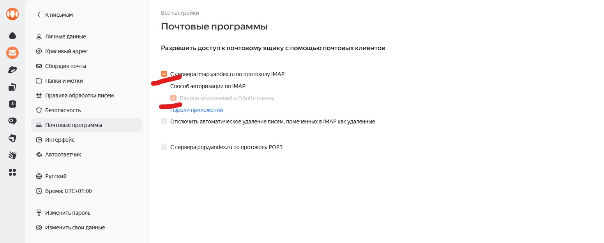

# Урок 25. Смена и восстановление пароля. Настройка SMTP

## Два разных сценария с паролями

В этом уроке разберём два похожих, но принципиально разных случая:

- **Смена пароля** — пользователь авторизован, знает текущий пароль и хочет его поменять.
- **Восстановление пароля** — пользователь не помнит пароль и не может войти. Нужна цепочка с email и одноразовым токеном.

Оба сценария уже реализованы в `django.contrib.auth.views` — нам нужно подключить шаблоны и настроить email-бэкенд.

---

## Часть 1. Смена пароля

### Встроенные представления

Маршруты `password_change` и `password_change_done` уже подключены через `include('django.contrib.auth.urls')` из прошлого урока. Django ищет их шаблоны в папке `registration/`:

```
templates/
└── registration/
    ├── login.html               ← уже сделан
    ├── password_change_form.html
    └── password_change_done.html
```

### Шаблон формы смены пароля

```html
<!-- templates/registration/password_change_form.html -->


Смена пароля


    <h1>Смена пароля</h1>

    <form method="POST">
        
        
            <p>
                {{ field.label_tag }}
                {{ field }}
                
                    <span class="error">{{ field.errors }}</span>
                
                
                    <small>{{ field.help_text }}</small>
                
            </p>
        
        <button type="submit">Сменить пароль</button>
    </form>

```

### Шаблон подтверждения

```html
<!-- templates/registration/password_change_done.html -->


Пароль изменён


    <h1>Пароль успешно изменён</h1>
    <p>Ваш пароль обновлён. В следующий раз используйте новый пароль для входа.</p>
    <a href="">На главную</a>

```

Страница смены пароля защищена автоматически — `PasswordChangeView` наследует логику, которая требует авторизации. Неавторизованный пользователь будет перенаправлен на страницу входа.

Добавим ссылку на смену пароля в навигацию — например, рядом с именем пользователя в `base.html`:

```html

    | {{ user.username }}
    | <a href="">Сменить пароль</a>
    <form method="POST" action="" style="display: inline;">
        
        <button type="submit" class="nav-link-btn">Выйти</button>
    </form>

```

---

## Часть 2. Восстановление пароля

### Алгоритм восстановления

Восстановление пароля — это не просто форма с полем email. Это цепочка шагов, каждый из которых решает свою задачу безопасности:

```
Пользователь вводит email
        ↓
Django проверяет, есть ли такой пользователь
        ↓
Создаётся одноразовый токен, привязанный к пользователю
        ↓
На email отправляется ссылка с токеном и uidb64
        ↓
Пользователь переходит по ссылке
        ↓
Django проверяет токен: корректен? не просрочен? соответствует пользователю?
        ↓
Пользователь вводит новый пароль
        ↓
Пароль сохраняется, токен становится недействительным
```

> **Важная деталь безопасности:** Django всегда показывает одно и то же сообщение после отправки формы — независимо от того, существует email в базе или нет. Это защита от подбора аккаунтов: злоумышленник не может узнать, зарегистрирован ли конкретный email на сайте.

### Что такое uidb64 и токен

`uidb64` — это `id` пользователя, закодированный в base64. `token` — одноразовый хэш, который Django генерирует на основе данных пользователя и временной метки. После использования или через определённое время (по умолчанию 3 дня) токен становится недействительным.

### Подключение маршрутов

Все четыре представления восстановления пароля уже входят в `django.contrib.auth.urls`. Для кастомизации шаблонов достаточно создать нужные файлы в `registration/`. Если нужна более тонкая настройка (другой `success_url`, кастомный email-шаблон) — переопределяем представления явно:

```python
# filmsite/urls.py
from django.contrib.auth.views import (
    PasswordResetView,
    PasswordResetDoneView,
    PasswordResetConfirmView,
    PasswordResetCompleteView,
)
from django.urls import reverse_lazy

urlpatterns = [
    path('admin/', admin.site.urls),
    path('accounts/login/', LoginView.as_view(authentication_form=CustomAuthenticationForm), name='login'),
    path('accounts/register/', RegisterView.as_view(), name='register'),

    # Восстановление пароля — переопределяем для указания кастомных шаблонов
    path('accounts/password-reset/',
        PasswordResetView.as_view(
            template_name='registration/password_reset_form.html',
            email_template_name='registration/password_reset_email.html',
            success_url=reverse_lazy('password_reset_done'),
        ),
        name='password_reset',
    ),
    path('accounts/password-reset/done/',
        PasswordResetDoneView.as_view(
            template_name='registration/password_reset_done.html',
        ),
        name='password_reset_done',
    ),
    path('accounts/reset/<uidb64>/<token>/',
        PasswordResetConfirmView.as_view(
            template_name='registration/password_reset_confirm.html',
            success_url=reverse_lazy('password_reset_complete'),
        ),
        name='password_reset_confirm',
    ),
    path('accounts/reset/done/',
        PasswordResetCompleteView.as_view(
            template_name='registration/password_reset_complete.html',
        ),
        name='password_reset_complete',
    ),

    path('accounts/', include('django.contrib.auth.urls')),
    path('', include('films.urls')),
]
```

### Шаблоны восстановления пароля

**Форма запроса:**

```html
<!-- templates/registration/password_reset_form.html -->


Восстановление пароля


    <h1>Восстановление пароля</h1>
    <p>Укажите email, связанный с вашим аккаунтом.</p>

    <form method="POST">
        
        
            <p>
                {{ field.label_tag }}
                {{ field }}
                
                    <span class="error">{{ field.errors }}</span>
                
            </p>
        
        <button type="submit">Отправить письмо</button>
    </form>

    <p><a href="">← Вернуться к входу</a></p>

```

**Письмо отправлено:**

```html
<!-- templates/registration/password_reset_done.html -->


Письмо отправлено


    <h1>Письмо отправлено</h1>
    <p>
        Если аккаунт с таким email существует, на него отправлены
        инструкции по восстановлению пароля.
    </p>
    <p>Проверьте папку «Спам», если письмо не пришло в течение нескольких минут.</p>

```

**Шаблон самого письма** — это текстовый файл, не HTML-страница:

```
<!-- templates/registration/password_reset_email.html -->
Вы получили это письмо, потому что был запрошен сброс пароля для аккаунта на сайте фильмов.

Перейдите по ссылке, чтобы задать новый пароль:
{{ protocol }}://{{ domain }}

Ссылка действует 3 дня.

Если вы не запрашивали восстановление пароля — просто проигнорируйте это письмо.
```

**Форма ввода нового пароля:**

```html
<!-- templates/registration/password_reset_confirm.html -->


Новый пароль


    <h1>Введите новый пароль</h1>

    
        <form method="POST">
            
            
                <div class="error">{{ form.non_field_errors }}</div>
            
            
                <p>
                    {{ field.label_tag }}
                    {{ field }}
                    
                        <span class="error">{{ field.errors }}</span>
                    
                </p>
            
            <button type="submit">Сохранить пароль</button>
        </form>
    
        <p>Ссылка для сброса пароля недействительна — возможно, она уже была использована или срок её действия истёк.</p>
        <a href="">Запросить новую ссылку</a>
    

```

Переменная `validlink` — это булев флаг, который `PasswordResetConfirmView` добавляет в контекст. `True` — токен корректный, `False` — истёк или уже использован. Проверка на `validlink` обязательна: без неё форма будет показываться даже при переходе по устаревшей ссылке.

**Завершение восстановления:**

```html
<!-- templates/registration/password_reset_complete.html -->


Пароль изменён


    <h1>Пароль успешно изменён</h1>
    <p>Теперь вы можете <a href="">войти</a> с новым паролем.</p>

```

Добавим ссылку «Забыли пароль?» в шаблон входа:

```html
<!-- templates/registration/login.html — добавляем после кнопки -->
<p><a href="">Забыли пароль?</a></p>
```

---

## Часть 3. Настройка SMTP через Яндекс

### Этап разработки — консольный бэкенд

Прежде чем настраивать реальную почту, убедимся, что механизм вообще работает. Django предоставляет консольный бэкенд: все письма выводятся прямо в терминал вместо отправки:

```python
# filmsite/settings.py
EMAIL_BACKEND = 'django.core.mail.backends.console.EmailBackend'
```

Проверка через shell:

```bash
python manage.py shell
```

```python
from django.core.mail import send_mail

send_mail(
    subject='Тест: Сайт фильмов',
    message='Проверка отправки письма.',
    from_email='no-reply@filmsite.local',
    recipient_list=['test@example.com'],
)
```

Если в терминале появилось письмо — бэкенд работает.

> **Кодировка в консоли.** Тело письма может отображаться в base64 — Django кодирует UTF-8 текст для MIME. В реальном почтовом клиенте письмо декодируется автоматически. Для проверки содержимого в консоли можно использовать:
>
> ```python
> import base64
> print(base64.b64decode('закодированный_текст').decode('utf-8'))
> ```

### Подготовка Яндекс-аккаунта

**Шаг 1.** Зайди в **настройки** Яндекс.Почты → раздел **«Почтовые программы»** → убедись, что доступ для почтовых клиентов по IMAP/SMTP включён.

Настройки → Почтовые программы



---

**Шаг 2.** Перейди по адресу [https://id.yandex.ru/security/app-passwords](https://id.yandex.ru/security/app-passwords) и создай пароль приложения:
- Тип приложения: **Почта**
- Название: например, `filmsite-django`

> Пароль приложения показывается **только один раз** — сохрани его сразу. Основной пароль от почты для SMTP не подойдёт — Яндекс блокирует такие попытки.

### Настройка в settings.py

```python
# filmsite/settings.py

EMAIL_BACKEND = 'django.core.mail.backends.smtp.EmailBackend'

EMAIL_HOST = 'smtp.yandex.ru'
EMAIL_PORT = 465
EMAIL_USE_SSL = True

EMAIL_HOST_USER = 'mikheyxd@yandex.ru'
EMAIL_HOST_PASSWORD = 'пароль_приложения'

DEFAULT_FROM_EMAIL = EMAIL_HOST_USER
SERVER_EMAIL = EMAIL_HOST_USER
```

| Параметр | Значение | Назначение |
|---|---|---|
| `EMAIL_BACKEND` | `smtp.EmailBackend` | Использовать SMTP вместо консоли |
| `EMAIL_HOST` | `smtp.yandex.ru` | SMTP-сервер Яндекса |
| `EMAIL_PORT` | `465` | Порт для SSL-соединения |
| `EMAIL_USE_SSL` | `True` | Шифрование SSL |
| `EMAIL_HOST_USER` | ваш email | Адрес отправителя |
| `EMAIL_HOST_PASSWORD` | пароль приложения | Не основной пароль от почты |
| `DEFAULT_FROM_EMAIL` | ваш email | Адрес в поле «От» для Django-писем |

### Хранение учётных данных безопасно

До этого мы записывали логин и пароль прямо в `settings.py`:

```python
EMAIL_HOST_USER = 'your_email@yandex.ru'
EMAIL_HOST_PASSWORD = 'пароль_приложения'
```

Для учебных примеров это допустимо, но в реальных проектах так делать нельзя.

Причин несколько:

- пароль может случайно попасть в Git;
- доступ к репозиторию могут получить другие разработчики;
- при публикации проекта на GitHub секретные данные окажутся в открытом доступе;
- для разных окружений (локальный компьютер, тестовый сервер, production) обычно используются разные значения.

Поэтому в большинстве проектов чувствительные данные хранят в **переменных окружения** (*Environment Variables*).

---

#### **Что такое `.env`**

Файл `.env` — это обычный текстовый файл, содержащий пары вида:

```text
ИМЯ_ПЕРЕМЕННОЙ=значение
```

Например:

```text
EMAIL_HOST_USER=your_email@yandex.ru
EMAIL_HOST_PASSWORD=gdtrhsudebwsgki
SECRET_KEY=django-secret-key
DEBUG=True
```

Такой файл не загружается в Git и хранится только на компьютере разработчика или на сервере.

---

#### **Устанавливаем библиотеку**

Сам Python не умеет автоматически читать файл `.env`, поэтому обычно используют библиотеку **python-dotenv**.

Установим её:

```bash
pip install python-dotenv
```

---

#### **Создаём файл `.env`**

В корне проекта создадим файл

```text
.env
```

со следующим содержимым:

```text
EMAIL_HOST_USER=your_email@yandex.ru
EMAIL_HOST_PASSWORD=gdtrhsudebwsgki
```

---

#### **Подключаем `.env` в Django**

В начале `settings.py` подключим библиотеку:

```python
from dotenv import load_dotenv
import os
```

Затем загрузим переменные окружения:

```python
load_dotenv()
```

Теперь можно получать значения:

```python
EMAIL_HOST_USER = os.getenv('EMAIL_HOST_USER')
EMAIL_HOST_PASSWORD = os.getenv('EMAIL_HOST_PASSWORD')
```

или

```python
EMAIL_HOST_USER = os.environ.get('EMAIL_HOST_USER')
EMAIL_HOST_PASSWORD = os.environ.get('EMAIL_HOST_PASSWORD')
```

Оба варианта используются достаточно часто.

---

#### **Добавляем `.env` в Git**

Файл `.env` обязательно нужно добавить в `.gitignore`, чтобы случайно не отправить секретные данные в репозиторий.

```text
# .gitignore

.env
```

После этого Git перестанет отслеживать этот файл.

---

#### **Что обычно хранят в `.env`**

Помимо логина и пароля SMTP, через переменные окружения обычно хранят:

- `SECRET_KEY`;
- `DEBUG`;
- параметры подключения к базе данных;
- токены Telegram-ботов;
- API-ключи сторонних сервисов;
- ключи платёжных систем;
- любые пароли и секретные данные.

---

#### **Файл `.env.example`**

Возникает логичный вопрос: если файл `.env` не хранится в репозитории, то как другой разработчик поймёт, какие переменные необходимо создать?

Для этого обычно создают файл **`.env.example`**.

В него записывают **названия всех необходимых переменных**, но без настоящих секретных данных.

Например:

```text
EMAIL_HOST_USER=<your_email>
EMAIL_HOST_PASSWORD=<your_app_password>

SECRET_KEY=<your_secret_key>

DEBUG=True
```

Такой файл **можно и нужно** добавлять в Git.

Когда другой разработчик скачает проект, ему останется только:

- Скопировать файл
- Подставить свои значения вместо примеров.

---

### Проверка

```
1. Перейди на /accounts/password-reset/
2. Введи email пользователя, зарегистрированного в БД
3. Нажми «Отправить письмо»
4. Открой почтовый ящик — письмо должно прийти в течение минуты
   (проверь папку «Спам», если не пришло)
5. Перейди по ссылке из письма
6. Введи новый пароль
7. Войди на сайт с новым паролем
```

---

## Подводные камни

### SMTPAuthenticationError

Наиболее частая ошибка при первом подключении. Причины: используется основной пароль от почты вместо пароля приложения, опечатка в `EMAIL_HOST_USER`, не включён доступ для почтовых клиентов в настройках Яндекса. Решение: создать новый пароль приложения и убедиться в корректности всех параметров.

### Письма не приходят, ошибок нет

Скорее всего письмо попало в «Спам» — особенно часто при отправке с домена `localhost` или `127.0.0.1`. Для тестов используй реальный почтовый ящик с доступом.

### validlink в шаблоне сброса

Без проверки `` в `password_reset_confirm.html` пользователь будет видеть форму ввода пароля даже при переходе по устаревшей ссылке — после отправки получит непонятную ошибку. Всегда проверяй `validlink` и показывай понятное сообщение для недействительных токенов.

### EMAIL_USE_TLS vs EMAIL_USE_SSL

Яндекс поддерживает два варианта:

```python
# SSL (порт 465) — рекомендуется
EMAIL_PORT = 465
EMAIL_USE_SSL = True

# TLS/STARTTLS (порт 587) — альтернатива
EMAIL_PORT = 587
EMAIL_USE_TLS = True
```

Нельзя включать оба одновременно — `EMAIL_USE_SSL` и `EMAIL_USE_TLS` взаимоисключающие.

---

## Вопросы для проверки

1. Чем смена пароля отличается от восстановления с точки зрения требований к пользователю?
2. Почему Django всегда показывает одно и то же сообщение после отправки формы восстановления — независимо от того, существует email или нет?
3. Что такое `validlink` в контексте `PasswordResetConfirmView` и зачем его проверять в шаблоне?
4. Почему нельзя использовать основной пароль от Яндекс-почты в `EMAIL_HOST_PASSWORD`?
5. Чем `EMAIL_USE_SSL` отличается от `EMAIL_USE_TLS` и можно ли включить оба?

---

## Практическая задача

**Тип: расширь проект**

**Часть 1.** Создай все четыре шаблона для восстановления пароля и добавь ссылку «Забыли пароль?» на страницу входа.

**Часть 2.** Настрой консольный бэкенд и проверь работу через браузер: запроси восстановление пароля для существующего пользователя, найди ссылку в консоли (или расшифруй base64), перейди по ней и смени пароль.

**Часть 3.** Переключись на SMTP-бэкенд с Яндекс-почтой. Создай пароль приложения, заполни настройки в `settings.py` и проверь, что письмо доходит до реального почтового ящика.

**Часть 4 (опционально).** Вынеси `EMAIL_HOST_USER` и `EMAIL_HOST_PASSWORD` в переменные окружения — не храни учётные данные прямо в `settings.py`.

---

## Доп информация для пользователей `macos`

<details>
<summary><b>Ошибка ssl.SSLCertVerificationError</b></summary>

## Решение ошибки `ssl.SSLCertVerificationError` при работе с SMTP на macOS

При настройке отправки почты через SMTP (например, для восстановления пароля в Django) можно столкнуться с ошибкой:

```text
ssl.SSLCertVerificationError:
[SSL: CERTIFICATE_VERIFY_FAILED]
certificate verify failed:
unable to get local issuer certificate
```

Эта ошибка означает, что Python не может проверить SSL-сертификат SMTP-сервера, так как в системе отсутствует (или не подключено) хранилище доверенных корневых сертификатов.

Важно понимать, что проблема **не связана с Django, SMTP или настройками почты** — она возникает на уровне Python.

---

## Шаг 1. Убедитесь, что проблема действительно в SSL

Попробуйте подключиться к SMTP напрямую:

```python
import smtplib
import ssl

context = ssl.create_default_context()

with smtplib.SMTP_SSL("smtp.yandex.ru", 465, context=context) as server:
    server.login("your_email@yandex.ru", "пароль_приложения")
```

Если появляется та же ошибка `CERTIFICATE_VERIFY_FAILED`, значит проблема точно не в Django.

---

## Шаг 2. Проверяем наличие сертификатов

Выполните:

```python
import ssl

print(ssl.get_default_verify_paths())
```

Если вывод похож на следующий:

```python
DefaultVerifyPaths(
    cafile=None,
    capath=None,
    ...
)
```

то Python не смог найти доверенные сертификаты.

Также можно проверить количество загруженных сертификатов:

```python
import ssl

print(len(ssl.create_default_context().get_ca_certs()))
```

В норме должно быть примерно **100–200 сертификатов**.

---

## Шаг 3. Если Python установлен с python.org

Если Python установлен с официального сайта, после установки необходимо выполнить специальный скрипт:

```
Install Certificates.command
```

Он находится здесь:

```
/Applications/Python 3.x/
```

Например:

```
/Applications/Python 3.13/
```

Запустить его можно двумя способами.

### Через Finder

Откройте папку:

```
Applications → Python 3.13
```

и дважды щелкните по файлу

```
Install Certificates.command
```

### Через терминал

```bash
open "/Applications/Python 3.13/Install Certificates.command"
```

После выполнения скрипта Python автоматически подключит системное хранилище сертификатов.

---

## Шаг 4. Повторная проверка

Снова выполните:

```python
import ssl

print(len(ssl.create_default_context().get_ca_certs()))
```

Теперь количество сертификатов должно быть значительно больше нуля.

После этого SMTP обычно начинает работать без каких-либо дополнительных настроек.

---

# Следующая возможная ошибка

После исправления SSL может появиться ошибка:

```text
UnicodeEncodeError:
'ascii' codec can't encode characters...
```

Она означает, что SMTP не смог закодировать логин или пароль.

Чаще всего причина одна из двух:

- в `EMAIL_HOST_USER` указан не настоящий адрес электронной почты, а текст вроде

```python
EMAIL_HOST_USER = 'ваш_адрес@yandex.ru'
```

- либо в логине присутствуют символы, отличные от ASCII.

Правильно:

```python
EMAIL_HOST_USER = 'my_email@yandex.ru'
EMAIL_HOST_PASSWORD = 'пароль_приложения'
```

---

# Будет ли эта проблема на Linux?

Практически всегда — **нет**.

На большинстве современных Linux-дистрибутивов (`Ubuntu`, `Debian`, `Rocky Linux` и др.) пакет `ca-certificates` уже установлен, поэтому Python сразу использует системное хранилище сертификатов.

Поэтому на VPS подобная ошибка встречается крайне редко.

</details>

---

[Предыдущий урок](lesson24.md) | [Следующий урок](lesson26.md)