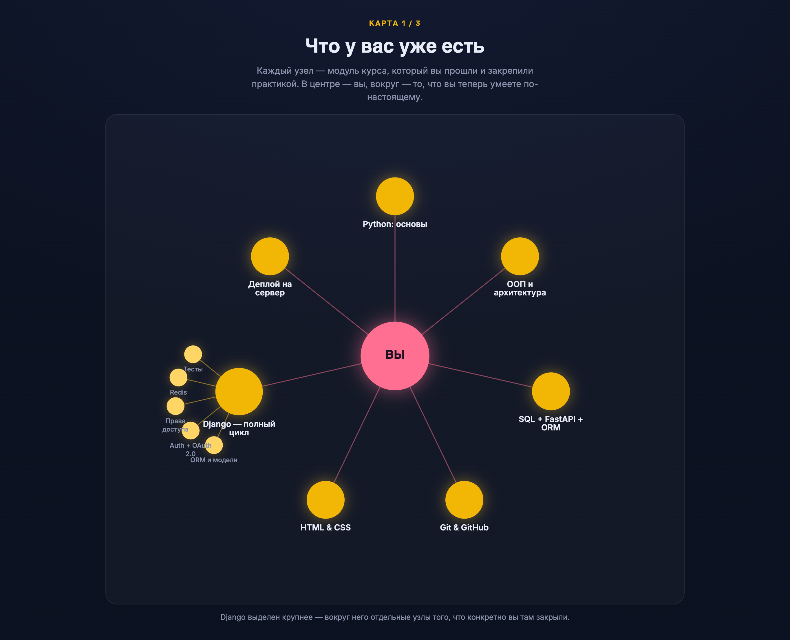
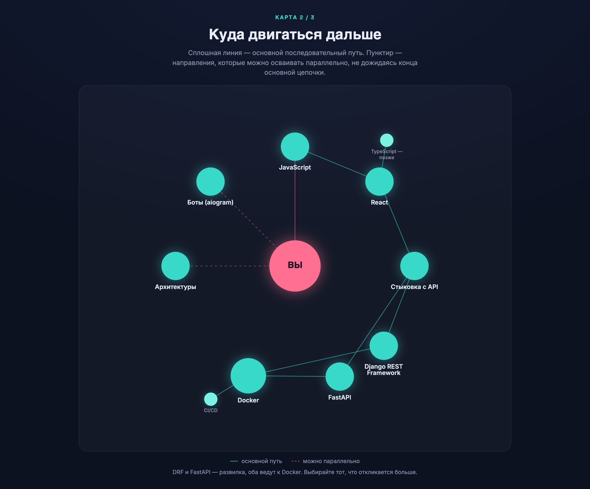
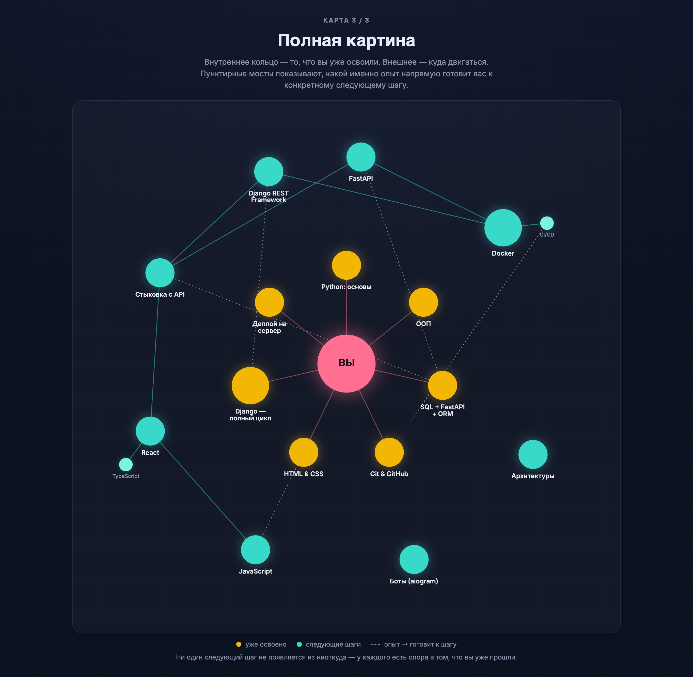

# Куда двигаться дальше

Курс закончен. Прежде чем говорить о том, что дальше, стоит остановиться и честно посмотреть назад — на то, что вы на самом деле построили за это время. Это не формальность: если пролистать материал бегло, легко обесценить проделанную работу и решить, что «ну, это же был просто учебный курс». На деле — нет. Разберём по порядку, что у вас реально есть сейчас, а потом — куда двигаться дальше и почему именно в таком порядке.

---

## Что у вас уже есть за плечами

### Python: язык и его синтаксис

Вы прошли не «основы синтаксиса ради синтаксиса», а полноценный набор инструментов, которым реально пользуются каждый день: работу с файлами разных форматов (txt, csv, json), нормальную культуру обработки ошибок, а не игнорирование исключений, декораторы — от идеи «функция, принимающая функцию» до синтаксиса `@`, который в реальном коде встречается повсеместно, от Django до FastAPI. Отдельно стоит выделить асинхронность — генераторы через `yield` и `async`/`await`. Это тема, которую многие курсы пропускают или дают поверхностно, а вы разобрали её на уровне идеи, а не только синтаксиса. Это окупится уже совсем скоро, когда речь пойдёт про FastAPI.

### ООП и архитектурное мышление

Инкапсуляция, полиморфизм, наследование — стандартный набор, но важно не что вы их прошли, а как: на примерах, которые по поведению были похожи на настоящие веб-фреймворки, и уже там вы работали с терминами вроде запроса, ответа, статус-кода, хедеров и тела запроса. Это значит, что когда вы позже открыли Django и увидели `request`/`response`, это не были новые незнакомые слова — вы уже понимали, что за ними стоит. ООП — это ещё и то, что позволяет читать чужой код (а вы будете читать очень много чужого кода) и понимать, что происходит внутри любого фреймворка, а не только использовать его как чёрный ящик.

### SQL и первый API

Здесь вы прошли путь от чистого SQL (SQLite Studio, базовый синтаксис, разноплановые задачи) до взаимодействия с базой из кода. Специально взяли базовый FastAPI без асинхронности — чтобы не перегружать материал и сосредоточиться на самой концепции API. Тут же разобрали, что такое ORM, на примере SQLAlchemy, и интегрировали её в тот же проект. Итог — рабочий, пусть и небольшой, API, который создавался с прицелом на то, что позже станет частью полноценного приложения с интерфейсом. Этот прицел, кстати, сыграет свою роль совсем скоро — ниже в этом же материале.

### Git и совместная работа

Вы прошли путь от простого сохранения версий до сценариев, где рядом работают ещё один-два человека. Полноценную командную работу разбирать не стали — на тот момент она была бы избыточной, без реального контекста это просто ещё один набор незнакомых слов. Но база, без которой невозможна работа ни на одном проекте, у вас есть.

### HTML/CSS — необходимый, но неполный старт

Честно: этот модуль прошёл без JS, и это единственный по-настоящему слабый участок во всей программе. Для бэкенд-направления это не было первым приоритетом с самого начала, но по факту сейчас это то самое место, которое стоит закрыть в первую очередь — про это подробно ниже.

### Django — от идеи до реального сервера

А вот здесь курс сработал на максимум. У вас есть не учебный черновик, а полноценный, живой проект — сайт с фильмами — который прошёл весь путь, который в принципе может пройти веб-приложение: несколько связанных между собой сущностей, реальное взаимодействие с пользователем, регистрация и аутентификация, включая OAuth 2.0 (вход через сторонний сервис — то, с чем далеко не каждый выпускник курса вообще сталкивался), работа с правами доступа, логирование, знакомство с Redis, тестирование через `TestCase` — и, что важнее всего, **реальный деплой на удалённый сервер Ubuntu**, а не «работает только у меня на компьютере». Это тот уровень, который многие джуниор-вакансии прямо требуют как порог входа, и вы его уже прошли не в теории, а руками.

---

Если сложить всё это вместе: у вас есть уверенный Python, понимание ООП на уровне архитектуры, знание SQL и опыт с ORM в двух разных экосистемах (SQLAlchemy и Django ORM), базовые навыки Git, и — как вишенка — полностью рабочий, задеплоенный проект с авторизацией и тестами. Это по-настоящему сильная база. Год потрачен не зря: большинство людей, которые учатся веб-разработке самостоятельно, к деплою с авторизацией и тестами на реальном сервере доходят далеко не за год, а то и не доходят вовсе. Дальше — куда с этой базой двигаться.

---

## Куда двигаться дальше

Единственный настоящий пробел в вашей подготовке — это JS, и именно поэтому весь дальнейший путь логично начинать с него.

### 1. JavaScript — обязательный первый шаг

Без JS невозможно увидеть, как на самом деле происходит взаимодействие клиента и сервера с другой стороны провода — что такое `fetch`, как формируется и уходит запрос, что браузер делает с ответом, как страница обновляется без полной перезагрузки. Весь курс вы были по одну сторону этого разговора; JS — это возможность увидеть его целиком. Не нужно сразу нырять во фреймворки — достаточно уверенно закрыть DOM, события, `fetch`, асинхронность в JS (промисы, `async`/`await` — концептуально вы это уже проходили в Python, будет заметно проще).

**Примерный список тем**:

**Модуль 1. Основы JavaScript**
- Урок 16. Введение в JS: скрипты, консоль, `let/const/var`, типы данных, операторы, `if`/тернарник
- Урок 17. Циклы (`for`, `while`), функции: обычные / function expression / стрелочные

**Модуль 2. Структуры данных и ООП в JavaScript**
- Урок 18. Массивы и методы (`map`/`filter`/`forEach`/`find`), объекты, деструктуризация
- Урок 19. Классы в JS: свойства, методы, конструктор

**Модуль 3. JavaScript в браузере**
- Урок 20. Области видимости и замыкания (на практических примерах)
- Урок 21. DOM + BOM: `querySelector`, события, `window`/`location`/`localStorage`

**Модуль 4. Асинхронность и интеграция с API**
- Урок 22. `callback` → `Promise` → `async/await`, `fetch`
- Урок 23. Финальная практика: фронтенд поверх Blog API

*Это урезанный список тем, которых будет достаточно для базового понимания взаимодействия приложений. Можно сгенерировать через ИИ предварительно зарузив в нее весь предедущий курс.*

---

### 2. React — чтобы собрать современный фронтенд

Логичное продолжение после уверенного JS. Выбор в пользу React, а не Vue или Angular, обоснован просто: в нём до сих пор живут все актуальные паттерны фронтенда, и это самая массово востребованная технология на рынке. Плюс это SPA — вы увидите, чем «приложение на одной странице» принципиально отличается от классического Django-рендеринга шаблонов, которым вы пользовались весь курс.

Если хочется быстрее увидеть результат — необязательно проходить через полноценный React-проект прямо сейчас. Можно сразу после уверенного JS соединить простую страницу с уже готовым API из `python-sql-base` (шаг 3) — и вернуться к React уже позже, когда будет время вложиться в него основательно.

> 🔗 Рекомендованные материалы:
- Платформа: youtube
  - Канал: PurpleSchool | Anton Larichev
  - Ссылка: [Видео по React](https://youtu.be/u-pFUeGA2VY?si=-4lrO9WOs3VtL84v)

---

**Про TypeScript.** Ожидается почти в каждой вакансии на фронтенд, и списывать его со счетов не стоит. Но учить его без уверенного JS смысла нет: TS не заменяет JS, а достраивается поверх него. Для бэкендера, который сейчас хочет быстрее замкнуть цепочку **Фронт → Бэк → Docker → Деплой** и получить целостный проект в портфолио, TypeScript не маст-хэв на этом этапе — важнее не растягивать путь к результату. Возвращайтесь к нему уже после первого фронт-бэк-проекта, как осознанный дополнительный шаг. И честно: современные AI-инструменты сейчас неплохо генерируют рутинный фронтенд-код по запросу — именно поэтому TS стоит подтянуть в первую очередь среди «фронтенд-довесков»: он помогает уверенно читать, проверять и дорабатывать такой код руками, а не просто доверять результату вслепую.

> 🔗 Рекомендованные материалы:
- Платформа: youtube
  - Канал: PurpleSchool | Anton Larichev
  - Ссылка: [Видео по TS](https://youtu.be/1nq83ZrR4do?si=PLj7zgJekTF-DSaV)

---

### 3. Возврат к API из python-sql-base — замыкаем цикл

Как только фронтенд готов забирать данные с сервера — самое время вернуться к API на FastAPI + SQLAlchemy, который вы уже собирали, и по-настоящему соединить его с фронтом. Это не новый проект с нуля, а закрытие круга: тот самый API, который создавался «с прицелом на интерфейс», наконец этот интерфейс получает. Здесь стоит увидеть на практике вещи, которые в одиночном учебном бэкенде почти не заметны: CORS, форматы ответа под нужды конкретного интерфейса, обработку ошибок на стороне клиента, состояния загрузки.

---

### 4. Чистый API: Django REST Framework или FastAPI

Дальше — построение API на профессиональном уровне, не «на минималках». Здесь осознанно не буду говорить, что из двух вариантов лучше — у каждого своя сильная сторона, и оба закрываются знаниями, которые у вас уже есть.

**DRF** — вы уже отлично знаете Django целиком: модели, ORM, миграции, права доступа. DRF ложится поверх этого практически без разрыва — вы не изучаете фреймворк с нуля, а достраиваете то, что уже умеете, до полноценного API-слоя.

**FastAPI** — у вас уже был опыт с ним в `python-sql-base`, а вдобавок в `python-base` вы отдельно разбирали асинхронность. FastAPI построен вокруг неё с самого начала — это прямое продолжение именно этой части курса.

Выбирайте по тому, что откликается больше: обе дороги ведут к одному и тому же — уверенному построению API как самостоятельного слоя приложения.

> 🔗 Рекомендованные материалы DRF:

- Платформа: youtube
  - Канал: selfedu
  - Ссылка: [Плей-лист по DRF](https://www.youtube.com/playlist?list=PLA0M1Bcd0w8xZA3Kl1fYmOH_MfLpiYMRs)

> 🔗 Рекомендованные материалы FastAPI:

- Платформа: youtube
  - Канал: s6ptember
  - Ссылка: [Видео по FastAPI](https://youtu.be/c6OEJA7Y81c?si=9c-7dgYA9LGGGp16)

---

### 5. Docker — и что после него

Когда фронт и бэк готовы по отдельности — заворачиваем это всё в Docker. Есть два пути: поверхностный (посмотреть, что такое `Dockerfile` и `docker-compose`, и научиться копировать рабочие конфиги) и глубокий — по-настоящему разобраться, как работает каждый слой: образы, контейнеры, сети, volume. Второй путь предпочтительнее: понимание, как устроена изоляция окружения на уровне ОС, — универсальный навык, полезный в любом проекте, не только веб-разработке.

**Что естественно возникает следом — CI/CD.** *Как только у вас есть Docker-образ, возникает закономерный вопрос: а как этот образ автоматически собирается и попадает на сервер — без ручного `scp`/`ssh`, как вы делали при деплое Django-проекта? У вас уже есть все кусочки для этой цепочки: Git/GitHub из курса, теперь Docker — и GitHub Actions замыкает всё в единый процесс: пуш в репозиторий → тесты → сборка образа → деплой. Честно: по-настоящему это чувствуется только на реальном проекте с командой — без него легко один раз настроить и забыть, зачем это было нужно. Но понимание, из каких частей состоит эта цепочка, — уже отличная база для практики, когда появится настоящий кейс.*

**Контрольная точка.** На этом этапе логично закрыть первый блок портфолио: чистый Django-проект (он уже готов) плюс отдельные фронтенд и бэкенд, завёрнутые в Docker.

> 🔗 Рекомендованные материалы:

- Платформа: youtube
  - Канал: selfedu
  - Ссылка: [Плей-лист по Docker](https://www.youtube.com/playlist?list=PLA0M1Bcd0w8zznkO6nZoG8pWfKGK0RqBo)

---

### 6. Архитектуры: монолиты и микросервисы (можно параллельно)

Эту тему можно изучать параллельно с практическим треком выше — она больше про понимание, чем про руки. Стоит разобраться, почему монолиты (как ваш Django-проект) до сих пор массово используются и какие проблемы закрывают лучше, чем принято думать, посмотреть на микросервисы и попробовать собрать пару взаимодействующих сервисов самостоятельно. Честный момент: без реальной нагрузки преимущества микросервисов почти не видны — для небольшого проекта код часто становится объёмнее, а разделение выглядит избыточным. Это нормально: сама попытка собрать такую архитектуру руками уже даёт понимание паттерна.

---

### 7. Боты: aiogram

Отдельное направление вширь — разработка Telegram-ботов на `aiogram`. Может показаться менее значимым по сравнению с остальным роадмапом, но пользы в этом больше, чем кажется: низкий порог входа, реальный опыт работы с внешним API мессенджера, и — если в ближайшее время планируется фриланс — боты остаются одним из самых частых и доступных первых заказов.

> 🔗 Рекомендованные материалы:

*Видео на эту тему много. Конкретное рекомендовать не буду. Материал можно построить с помощью ИИ, главное сделать акцент на **последней версии библиотеки**. Не все модели могут корректно работать с этой версией.*

## Коротко о том, что не расписано отдельно

- **Командный Git-флоу** (ветки, Pull Request, код-ревью) — лучше усваивается на первом реальном проекте с чужим кодом, чем в отрыве от контекста.
- **Более глубокое тестирование** (`pytest`, покрытие) — база из Django `TestCase` уже есть, остальное — вопрос практики на конкретном проекте.

---

## Резюме: сохраните это себе

Компактная версия всего материала — чтобы держать перед глазами как чек-лист.

**Уже есть:**
- Python: синтаксис, файлы, ошибки, декораторы, асинхронность (`yield`, `async`/`await`)
- ООП: инкапсуляция, полиморфизм, наследование — на примерах, близких к вебу
- SQL + FastAPI (без async) + SQLAlchemy ORM — первый рабочий API
- Git/GitHub — соло и в паре
- HTML/CSS — без JS (пробел, закрывается первым пунктом ниже)
- Django — модели, ORM, admin, формы, CBV, авторизация и OAuth 2.0, права доступа, Redis, тесты, **реальный деплой на Ubuntu-сервер**

**Куда дальше — по порядку:**
1. JavaScript — DOM, события, `fetch`, асинхронность
2. React — SPA, компонентный подход (TypeScript — позже, отдельным шагом)
3. Соединить фронт с уже готовым API из `python-sql-base`
4. DRF или FastAPI — взрослый API-слой (оба варианта равноценны)
5. Docker (глубоко) → CI/CD (GitHub Actions) — *контрольная точка: второй проект в портфолио*
6. Архитектуры: монолиты vs микросервисы — можно параллельно
7. aiogram — Telegram-боты, для расширения кругозора и фриланса

---

## Визуализация связей ваших нынешних и будущих знаний:

### Что у вас уже есть

---

### Куда двигаться дальше

---

### Полная картина

---
