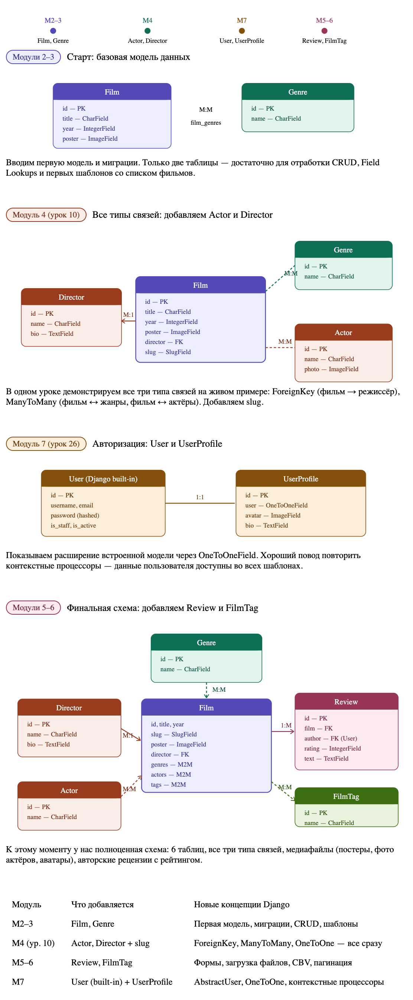

# Содержание

## Модуль 1. Django: старт проекта

- [Урок 1. Django и архитектура MTV. Создание первого проекта. Инструменты](lesson01.md)
- [Урок 2. Маршрутизация и функции представления. Динамические URL и конвертеры](lesson02.md)
- [Урок 3. GET и POST-запросы. Обработка ошибок. Redirect и reverse](lesson03.md)

## Модуль 2. Шаблоны

- [Урок 4. Введение в DTL. render() и передача данных в шаблон](lesson04.md)
- [Урок 5. Фильтры, теги if/for и тег url](lesson05.md)
- [Урок 6. Наследование шаблонов (extends) и тег include](lesson06.md)
- [Урок 7. Статические файлы. Пользовательские теги (simple_tag, inclusion_tag)](lesson07.md)

## Модуль 3. Модели и ORM

- [Урок 8. Модели Django. Миграции](lesson08.md)
- [Урок 9. CRUD через Django ORM. Field Lookups. Пользовательский менеджер модели](lesson09.md)
- [Урок 10. Связи между моделями: ForeignKey, ManyToMany, OneToOne — теория + ORM-команды для всех типов](lesson10.md)
- [Урок 11. Продвинутый ORM: Q, F, annotate(), агрегаты, группировка](lesson11.md)
- [Урок 12. Слаги в URL. get_absolute_url(). Django Debug Toolbar](lesson12.md)

## Модуль 4. Админ-панель

- [Урок 13. Подключение и регистрация моделей. Базовая настройка списка](lesson13.md)
- [Урок 14. Поиск, фильтры, пользовательские поля и действия в админ-панели Django](lesson14.md)
- [Урок 15. Настройка формы редактирования. Inline-модели. Внешний вид админки](lesson15.md)

## Модуль 5. Формы

- [Урок 16. Form и ModelForm: создание, отображение, сохранение в БД](lesson16.md)
- [Урок 17. Валидация полей. Пользовательские валидаторы](lesson17.md)
- [Урок 18. Загрузка файлов (FileField, ImageField). Отображение медиафайлов](lesson18.md)

## Модуль 6. Классы представлений (CBV)

- [Урок 19. Введение в CBV: View и TemplateView. Когда FBV, когда CBV](lesson19.md)
- [Урок 20. ListView и DetailView](lesson20.md)
- [Урок 21. FormView, CreateView, UpdateView, DeleteView](lesson21.md)
- [Урок 22. Mixins. Пагинация с ListView](lesson22.md)

## Модуль 7. Авторизация и пользователи

- [Урок 23. Система авторизации Django. LoginView, LogoutView, login_required, LoginRequiredMixin](lesson23.md)
- [Урок 24. Регистрация. UserCreationForm. Авторизация через email](lesson24.md)
- [Урок 25. Смена и восстановление пароля. Настройка SMTP](lesson25.md)
- [Урок 26. AbstractUser. Профиль пользователя. Контекстные процессоры](lesson26.md)
- [Урок 27. Разрешения и группы (Permissions & Groups)](lesson27.md)

## Модуль 8. Расширение стека

- [Урок 28. Переход на PostgreSQL. Fixtures для переноса данных](lesson28.md)
- [Урок 29. OAuth 2.0: вход через GitHub и ВКонтакте](lesson29.md)
- [Урок 30. Кэширование с Redis: установка, настройка, кэширование страниц](lesson30.md)
- [Урок 31. JWT — теория, сессии и токены](lesson31.md)
- [Урок 32. Тестирование с unittest (Django TestCase)](lesson32.md)

## Модуль 9. Деплой

- [Урок 33. Аренда сервера, домен и перенос проекта на сервер](lesson33.md)
- [Урок 34. Настройка Django, Gunicorn и Nginx](lesson34.md)
- [Урок 35. HTTPS, типичные ошибки деплоя и работа с сервером после запуска](lesson35.md)

---

[Бонус: Пре-деплой по шагам](lesson36.md)

---

[Список всех курсов](../README.md)

---

# Схема таблиц курса python-django

